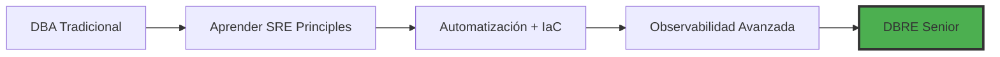

# DBA Cloud OnPrem AWS Skills Roadmap

Una guía completa de aprendizaje para Database Administrators que buscan evolucionar hacia roles modernos en entornos cloud-first con Infrastructure as Code, automatización y expertise en AWS.

## 📚 Roadmaps Disponibles

### Evolución Tradicional DBA
- [Junior DBA Roadmap (0-2 años)](./junior-dba-roadmap.md) - Habilidades fundamentales y progresión de 12 meses
- [Semi-Senior DBA Roadmap (2-5 años)](./semi-senior-dba-roadmap.md) - Habilidades avanzadas y desarrollo de liderazgo
- [Senior DBA Roadmap (5+ años)](./senior-dba-roadmap.md) - Liderazgo estratégico y arquitectura empresarial

### 🚀 **NUEVO: Database Reliability Engineer (DBRE)**
- [**DBRE Roadmap Completo**](./dbre-sre-roadmap.md) - El futuro de la administración de bases de datos
- [**Guía de Transición DBA → DBRE**](./dba-to-dbre-transition.md) - Plan de 12 meses para evolucionar tu carrera

### Guías Técnicas Especializadas
- [Terraform para DBAs](./terraform-guide.md) - Infrastructure as Code esencial
- [Python Automation](./python-automation.md) - Automatización de bases de datos y monitoreo
- [Bash Scripting](./bash-scripting.md) - Scripts operacionales y administración de sistemas
- [**SLIs y SLOs Explicados**](./sli-slo-guide.md) - Guía completa de métricas centradas en el usuario

## 🎯 ¿Cuál es tu Camino Ideal?

### 🔄 **DBA Tradicional → DBRE** (RECOMENDADO)
**¿Por qué DBRE?**
- **Salarios**: 40-60% más altos que DBA tradicional
- **Demanda**: +45% crecimiento anual en posiciones
- **Futuro**: Los DBAs tradicionales serán obsoletos en 3-5 años
- **Oportunidades**: 5x más posiciones disponibles



### 📈 **Progresión DBA Clásica**
Para quienes prefieren el camino tradicional con modernización gradual:


## 🔥 Insights Clave de Nuestra Investigación

### Evolución del DBA Moderno
Basado en nuestro análisis, la administración tradicional manual de bases de datos ha evolucionado para requerir:

- **Habilidades de Programación**: Python y Bash como competencias básicas
- **Infrastructure as Code**: Terraform esencial desde nivel Junior
- **Arquitectura Cloud**: Servicios AWS y mejores prácticas
- **Automatización**: Operaciones scriptadas reemplazando tareas manuales

### Impacto en el Mercado
- **Aumento Salarial**: 25-30% más compensación por habilidades modernas
- **Oportunidades Laborales**: 300% más posiciones disponibles
- **Demanda Industrial**: 95% de empresas cloud-first requieren habilidades IaC

## 🚀 Comenzando

### 1. Evalúa tu Nivel Actual
```bash
# Autoevaluación rápida
¿Puedes crear una instancia RDS con Terraform? → Junior DBA
¿Implementas monitoring automatizado con Python? → Semi-Senior DBA  
¿Defines SLIs/SLOs para sistemas de datos? → DBRE
¿Lideras estrategia de confiabilidad organizacional? → Senior DBRE
```

### 2. Identifica Brechas de Habilidades
Enfócate en Python, Bash y Terraform si te faltan:
- **Python**: Automatización y monitoreo de bases de datos
- **Bash**: Scripts operacionales y administración de sistemas
- **Terraform**: Infrastructure as Code para recursos de datos

### 3. Sigue el Camino Progresivo
- **Junior → Semi-Senior**: 18 meses con aprendizaje enfocado
- **Semi-Senior → Senior**: 24-36 meses con desarrollo de liderazgo
- **DBA → DBRE**: 12 meses de transición intensiva

### 4. Proyectos Prácticos
Implementa escenarios del mundo real de cada guía:
- **Lab Personal**: Cuenta AWS free tier con instancia RDS básica
- **Portfolio Terraform**: 3-5 plantillas de infraestructura
- **Scripts de Automatización**: Monitoreo y automatización de backups
- **Documentación**: Mantén un diario de aprendizaje y repositorio de código

## 📊 Comparación de Carreras: DBA vs DBRE

| Aspecto | DBA Tradicional | DBA Moderno | DBRE |
|---------|----------------|-------------|------|
| **Salario Promedio** | $75K - $95K | $95K - $120K | $120K - $220K+ |
| **Crecimiento Anual** | -5% (declive) | +15% | +45% |
| **Habilidades Clave** | SQL, Backups | SQL + Python + Terraform | SRE + Observabilidad + Chaos Engineering |
| **Enfoque** | Reactivo | Proactivo | Preventivo |
| **Herramientas** | GUI, Scripts manuales | Automatización, IaC | Plataformas, Observabilidad |
| **Futuro** | Obsolescencia | Estable | Alta demanda |

## 🎓 Cronograma de Progresión Profesional

### Opción A: Evolución Gradual (24-36 meses)
```
Mes 1-12:  Junior DBA → Semi-Senior DBA
Mes 13-24: Semi-Senior DBA → Senior DBA  
Mes 25-36: Senior DBA → Principal DBA
```

### Opción B: Transición DBRE (12-18 meses) ⭐ RECOMENDADO
```
Mes 1-3:   Fundamentos SRE + Mindset Shift
Mes 4-6:   Automatización + Infrastructure as Code
Mes 7-9:   Observabilidad + SLIs/SLOs
Mes 10-12: Chaos Engineering + Platform Engineering
Mes 13-18: Senior DBRE + Team Leadership
```

## 💰 ROI del Aprendizaje

### Inversión Típica
- **Tiempo**: 10-15 horas/semana durante 12-18 meses
- **Costo**: $500-1,500 en cursos y certificaciones
- **Esfuerzo**: Proyectos prácticos y lab personal

### Retorno Esperado
- **Aumento Salarial**: $25K-50K+ anual
- **Oportunidades**: 3-5x más posiciones disponibles
- **Seguridad Laboral**: Habilidades a prueba de futuro
- **Crecimiento**: Camino claro hacia roles de liderazgo

## 🌟 Testimonios de Éxito

> *"La transición a DBRE cambió completamente mi carrera. En 18 meses pasé de $85K como DBA a $145K como DBRE, y ahora lidero la estrategia de confiabilidad de datos en una startup unicornio."*
> 
> **— Sarah M., Senior DBRE en Fintech**

> *"Terraform y Python no eran opcionales - eran esenciales. Una vez que dominé IaC, las oportunidades se multiplicaron. Ahora trabajo 100% remoto para una empresa FAANG."*
> 
> **— Carlos R., Staff DBRE en Big Tech**

## 🔗 Enlaces Rápidos

### Para Empezar Hoy
- [Configuración de Lab AWS](./terraform-guide.md#getting-started)
- [Primer Script de Automatización](./python-automation.md#getting-started)
- [SLI/SLO Básico](./dbre-sre-roadmap.md#slis-slos-específicos-para-dbre)

### Comunidades y Recursos
- [SREcon Conferences](https://www.usenix.org/conferences/byname/925)
- [Database Reliability Engineering Book](https://www.oreilly.com/library/view/database-reliability-engineering/9781491925935/)
- [AWS Database Blog](https://aws.amazon.com/blogs/database/)
- [DBRE Slack Communities](./dba-to-dbre-transition.md#comunidades-y-networking)

---

## 🎯 Tu Próximo Paso

**¿Listo para transformar tu carrera?**

1. **Evalúa**: ¿Dónde estás ahora?
2. **Decide**: ¿DBA moderno o DBRE?
3. **Actúa**: Elige tu roadmap y comienza hoy
4. **Conecta**: Únete a las comunidades relevantes

El futuro de la administración de bases de datos está en la intersección de **expertise técnico profundo** y **ingeniería de confiabilidad moderna**. 

**La pregunta no es si debes evolucionar, sino qué tan rápido puedes hacerlo.**

---

*Esta roadmap refleja la realidad de 2025 donde Infrastructure as Code, monitoreo automatizado y gestión programática de bases de datos son expectativas básicas para DBAs modernos y DBREs.*

**¿Necesitas ayuda específica con algún aspecto del roadmap? ¡Cada guía incluye ejemplos prácticos y proyectos hands-on!**
